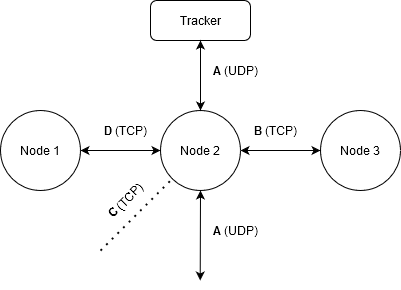
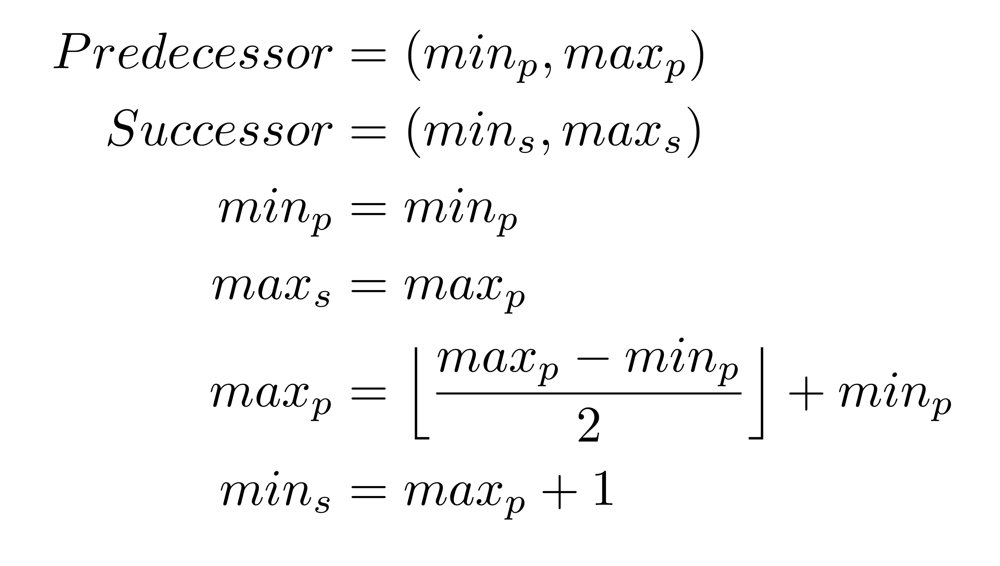

# Distributed hash table

Hash tables are a very efficient and common data structure for storing data.
Distributing a hash table is a common way to balance the load and allow for data
redundancy. This assignment aims to implement a distributed hash table
with a given interface and operations. **You are required to work in pairs
with this assignment.**


The distributed hash table has two different kinds of agents; nodes and
trackers. A node is a data container in the distributed hash table, where it
can function as a standalone network-accessed hash table, or form a distributed
hash table with other nodes. A tracker allows other nodes to acquire
information on other nodes and the network. The tracker provides two main
services to the nodes, including a lookup of a node that is connected to the
tracker, along with a `STUN` like service for address lookup. The `STUN`
service allows a node to request its public address from the tracker, to
which other nodes can connect.


A node has multiple sockets for communication with the tracker and other nodes,
more specifically it has 5 sockets. One for sending alive PDUs
periodically over UDP, one for incoming PDUs over UDP, two for maintaining a
TCP connection to its predecessor and successor respectively and one final TCP
socket for accepting successors. The successor and predecessor sockets are
recreated as new nodes join or leave the network. The maximum size of the
network is 256 nodes, with a hash range of 0-255. You are encouraged,
and expected, to test your implementation with other student implementations.

# Communication between nodes (PDU)
The communication between nodes, trackers, and possibly other agents
implementing the same interface, is performed using _Protocol data units_
(`PDU`). These are messages with predefined structure and semantics, a
fulldescription of all the existing PDUs can be found in the 
[PDU-specification](pdu_specification.md).

## Node functionality

The nodes should support the insertion and removal of successors and predecessors,
as well as insertion, removal, and lookup of table entries. The network does not
have to handle crashes, but no data is allowed to be lost when nodes
join or leave the network, as long as there is one node left in the network.


**5DV213:** Sockets must be managed using the `poll` API.


### Initiation of node
The initialization process is started with the node sending a request to the
tracker to acquire its address. Upon receiving the response with its
address, the node should send a message to get an entry point to the network,
in form of another connected node from the tracker. The response message from
the tracker contains the necessary information that is needed to join the
network.

An empty response means that there is currently no other node in the network.
A non-empty response indicates that the node should to
send a join message to the node that was included in the response from the tracker,
and subsequently, wait for a connection from its new predecessor. 
When connected, the predecessor should transmit a message
containing the new successor of the node, along with any entries that are to be
transferred to the new node. When the new node is connected to its successor,
the node is considered alive and should be sending alive messages to the tracker.


### Handle hash table request
A node should listen for incoming value PDUs over UDP, corresponding to
the insertion, removal, and lookup operations. If the key is outside of the
receivers hash range, the message should be forwarded to the receivers'
successor.
Otherwise, the desired operation should be performed on the nodes hash table,
and an appropriate response is sent back to the sender if expected by the
operation.


### Alive messages
A node can send alive messages to a tracker to allow other agents to interface with
the network. All connected nodes do not necessarily have to send alive messages to
the tracker, as only one node should suffice as the entry point into the network. By
allowing multiple nodes to register the tracker can perform load balancing of incoming
traffic.


### Insertion of a new node
Any alive node should be able to receive a join message over UDP, signaling that a
new node wants to join the network; The new node is inserted as a successor of
the node with the largest hash range in the network. To facilitate this, the
node should update the maximum values of the received join message and then
forward the message. When a node receives a join message with a complete match
on the maximum fields of the PDU (both address and port) the search for the
maximum hash range is complete. The receiver should then close the connection to its
successor using the defined close sequence, and connect to the prospect. When
connected to the new successor the node should send a join response to the
newly joined node, containing the previous successor of the receiver of the join
message.

### Distribution of the hash range 

When a node connects as its new successor, a part of the hash range should be transferred
to the new successor. The transfer is accomplished by taking the upper half of the
predecessor's hash range and sending it to the successor. The transmission of the
entries is performed using insertion messages.


### Leaving procedure
Nodes should be able to leave the network, which means that the values
contained in the node must be transmitted to another agent of the network. There are two
possible scenarios that nodes can experience. Those are that either successor or predecessor can leave
the network at any time. Depending on which of these leaves, it has to act differently to
restore the ring structure. The
hash range and data of a leaving node are transmitted to the predecessor or successor
of the node. The node should first close the connection to its successor or predecessor
using the defined close sequence, and
then transfer a message telling to expand the current hash
range, to store the new values. All stored entries in the leaving node should then be transferred to the receiving node using value insertion messages, followed by a message containing
the address and port of the successor or predecessor of the leaving node.
The node that receives the new values should use this data to connect to its
new successor or predecessor and restore the ring
structure in the network. 

### Disconnection of predecessors and successors
Before a socket connection can be closed between two nodes, a
special message telling the remote to close the connection must be transmitted
over the connection before it can be closed.

## Node states
A node can be represented as a state machine, where PDUs transition the node
between different states. Implementing the node as a state machine makes the
code easier to debug and hopefully less error-prone A graphical representation
of the node as a state machine follows.


## Node
The figure below pictures a node that is fully connected into the network,
meaning that the node has joined the network and has established connection to
the predecessor and successor. A fully connected node has to maintain a total
of five sockets. 

Sockets:

* A is used for sending/receiving messages to/from the tracker. It is also
used for receiving messages from agents outside of the network, and to
subsequently respond to them.
* B is used for sending/receiving messages to/from the successor.
* C is used for accepting new connections over TCP. 
* D is used for sending/receiving messages to/from the predecessor.




The new hash ranges of a predecessor and successor, when inserting a new
node in the network, can be calculated in the following way:



## Data

The data stored in the distributed hash table, also known as table entries, are
defined as follows:
* SSN (to be hashed with `djb2`)
* Name
* Email


There are many implicit and explicit rules of the distributed hash table, some
of the most important ones are listed below.

* Only one insertion of a node is performed at a time.
* SSN is represented as 12-bytes, YYYYMMDDXXXX, **no null termination**.
* Name and email fields are at most 255 characters, **no null termination**.
* Invalid PDUs can be dropped without response.
* A node that is about to join the network is called a prospect.
* A PDU field is described by either tag or value, followed by the storage size in bytes.
 E.g "NAME (10)" is a field with the tag NAME and storage size of ten bytes.
* All port fields are transmitted in `network byte order`, also known as `big-endian`.
    * It is crucial that you handle this correctly, as the communication will not function
      if there is cross-network varying byte order. 
    * Check the `htons` and `ntohs` functions in C, and the provided 
      `swapByteOrder` function in Java.


## Java-specific implementation details
Since Java lacks proper support for unsigned integers, special care has to be taken when
handling data in the PDUs. A port should probably not be represented as a `short`, even if
a port is a 16-bit integer, as implicit casts to a 32-bit `int` could result in a negative port.

When writing and reading the data to and from the network, however, the correct storage size must be
used. It does not matter if a byte is written signed or unsigned, as the interpretation of the integer
is left up to the receiver.

## Given code

Some parts of the distributed hash table are given with the assignment, these
include a fully implemented tracker, PDU definitions in Java, and C as well as
some sample network code. You are not required to use this given code, as long
as your implementations follow the given protocol and are compatible with
existing code. There is also a sample implementation of a node provided for
testing purposes, which is provided as a binary executable. * If you have issues
running the binary you can contact the tutors to get a copy of the source code.*

### 5DV212 
* Tracker
* Some PDU classes
* Hasher class wrapping the `djb2` hashing algorithm.

### 5DV213

* Tracker
* Some PDU structs
* Implementation of `djb2`

**Note:** the given hashing classes for both courses are compatible, i.e the
implementation in both C and Java should produce the same hash sum for a given input.


**Note:** It is assumed that no PDU sent over UDP can get corrupted or get dropped.


### Testing your node

Executable binaries are provided in the [bin](bin) folder.


## Examination
An implementation of the distributed hash table according to this
Specification. There must be no interface-breaking changes as your
implementation is expected to work with other student's implementations. The examination will contain two parts.

The first part is a functional demonstration; you will showcase your
solution to an examiner. You will be given a series of operations
to perform on the network by the examiner, and the network consisting of nodes
created by one or more node implementations, possibly including that of the examiner
is expected to be able to fulfill these operations with valid results.

The second part of the examination is the implementation examination. You will be
given time to show how you implemented the different parts of the node, how PDUs
are handled and similar parts. Prepare a list of features of highlights (or possibly
lowlights) of your implementation, explain what parts were difficult, what problems
you encountered and what parts of the implementation you are most satisfied with.

The code is not expected to be perfect, but you are as always required to structure
your code into commented functions. The C implementation does not have to be completely
free from memory/file descriptor leaks, but all present leaks must be static.


Your implementations should be able to start using the following terminal
commands:

*5DV198 DOI*
```bash
java Node <tracker address> <tracker port>
```

*5DV197 DOD*
```bash
./node <tracker address> <tracker port>
```
**Your implementation must utilize the `poll` API**

You are also to write a short report in which you analyze the performance of
the interface, your implementation, and what, if any, you think should be
changed with the interface to increase the performance of it or to simplify the
communication between nodes. The report should also contain a brief reflection
on difficulties and uncertainties that you encountered during the assignment. 
The report is to be handed in on labres.


### FSR/Syfte

Syftet med den här uppgiften är i första hand att ge övning i skapandet av
klient-serversystem och nätverksapplikationer. Lärandedelen för uppgiften
syftar till att ge möjlighet till att träna på delar av följande förväntade
studieresultat:

* Redogöra för Internets arkitektur, protokoll- och lagerkonceptet,
  grundläggande säkerhetsaspekter samt några viktiga applikationsprotokoll.(FSR 1)
* Redogöra för hur information överförs från punkt A till punkt B, inbegripet viktiga
  transportprotokoll och i det sammanhanget relevanta metoder och algoritmer. (FSR 2)
* Förklara hur en distribuerad applikation löser sina uppgifter och varför dess
  protokoll är utformat som det är . (FSR 5)
* Identifiera relevanta frågeställningar relaterade till dataöverföring. (FSR 6)
* Tillämpa socket- och trådprogrammering i en nätverksapplikation. (FSR 9)


Det tillhörande obligatoriska redovisningstillfället syftar till att examinera delar
av följande förväntade studieresultat:

* Tillämpa socket-och trådprogrammering i en nätverksapplikation. (FSR 9)

